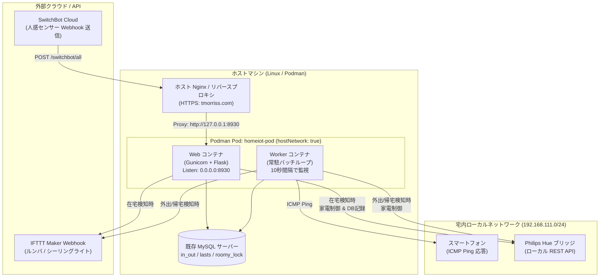
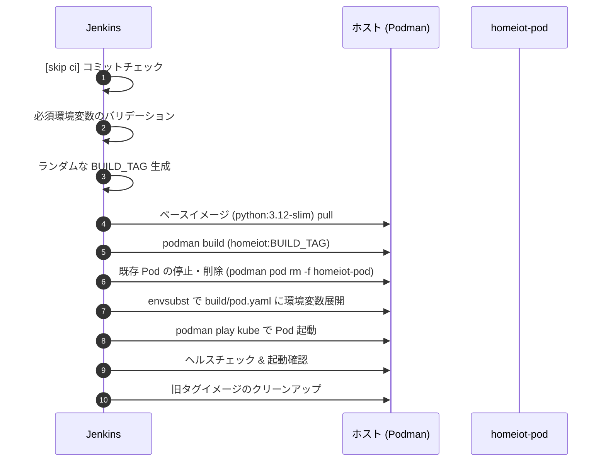

# HomeIotManager システム仕様書 (Architecture & System Specification)

本ドキュメントは、HomeIotManager のシステムアーキテクチャ、コンテナ設計、各コンポーネントの責務、データベース設計、および外部連携仕様を定義する正式版ドキュメントです。

---

## 1. システム概要

**HomeIotManager** は、在宅・外出の自動判定、スマート家電（Philips Hue、ルンバ、シーリングライト）の自動制御、および入退室履歴ログの保存を行う常駐型 IoT 連携管理システムです。

### 主な役割
- **在宅 / 外出の検知**:
  - スマートフォンの ICMP Ping 応答（宅内 Wi-Fi 接続状態）の定期監視
  - SwitchBot 人感センサー（`WoPresence`）からの Webhook イベント受信
- **スマート家電の自動制御**:
  - 帰宅時: 時間帯に応じた照明（Philips Hue、シーリングライト）の自動点灯、ルンバの自動帰還（Dock）
  - 外出時: 一定時間経過後の自動消灯、日中時間帯かつ未清掃時のルンバ自動清掃開始
- **設定・状態管理**:
  - ルンバ稼働抑制日（一時的な清掃停止日）の Web UI による設定・管理
  - MySQL による状態日時（`lasts`）、抑制日（`roomy_lock`）、入退室ログ（`in_out`）の永続化

---

## 2. 全体アーキテクチャ

---

## 3. コンテナ設計 (Podman Pod)

MoneyBook のサイドカー構成を踏襲し、Kubernetes 互換の Pod 定義（`build/pod.yaml`）により 1つの Pod `homeiot-pod` として動作します。

- **Web コンテナ (`homeiot_web`)**:
  - Gunicorn + Flask
  - ポート **8930** でリッスン（ホスト側の Nginx 等からプロキシ）
  - エンドポイント:
    - `POST /switchbot/all`: SwitchBot 人感センサー（`WoPresence`）の検知 Webhook 受信（トークン検証付き）
    - `GET /settings`, `POST /settings`: ルンバ稼働抑制日（`roomy_lock`）の設定・確認 Web UI
    - `GET /healthz`: ヘルスチェック用エンドポイント
- **Worker コンテナ (`homeiot_worker`)**:
  - 常駐 Python プロセス
  - 10秒間隔（定数 `CHECK_INTERVAL_SECONDS`）で在宅監視ループを実行
  - スマホへの Ping 疎通確認、在宅・外出の判定、ルンバ・照明の自動制御、DB 記録
- **ホストネットワーク共有 (`hostNetwork: true`)**:
  - Worker コンテナから宅内 LAN 上のスマートフォンへ ICMP Ping を直接送信する必要があること、およびローカルの Philips Hue ブリッジと直接通信するため、Pod 定義で `hostNetwork: true` を採用します。

---

## 4. データベース仕様 (MySQL)

既存の MySQL データベースおよびテーブルをそのまま利用します。
SQL クエリ発行時はプリペアドステートメント（パラメータバインド）を用い、SQL インジェクション対策を徹底します。

### テーブル定義

#### 1. `lasts` テーブル
各種イベントの最終日時を保持します。

| カラム名 | 型 | 説明 |
|---|---|---|
| `name` | `VARCHAR` (PK) | イベント種別キー (`in`, `out`, `roomy`, `hue_off`) |
| `time` | `DATETIME` | 最終記録日時 |

- `in`: 最終在宅検知時刻
- `out`: 最終外出確定（または帰宅開始）時刻
- `roomy`: 最終ルンバ稼働日/時刻
- `hue_off`: 最終 Hue 消灯時刻

#### 2. `roomy_lock` テーブル
ルンバの稼働を抑制する日付を保持します。当日がこの日付以前の場合はルンバを自動起動しません（※本テーブルは常に最新の 1 行のみが保持・設定される想定です）。

| カラム名 | 型 | 説明 |
|---|---|---|
| `date` | `DATE` | ルンバ稼働抑制指定日 |

#### 3. `in_out` テーブル
在宅・外出イベントの履歴ログテーブルです。

| カラム名 | 型 | 説明 |
|---|---|---|
| `datetime` | `DATETIME` | イベント発生日時 |
| `value` | `INT` | イベント種別 (`0`: 外出, `1`: 帰宅) |

---

## 5. 外部連携クライアント仕様

各外部インターフェースとの通信層は、独立したクライアントモジュールとして疎結合に実装します。

1. **ICMP Ping クライアント (`homeiot.clients.ping`)**:
   - `TARGET_PHONE_IPS` に定義された各スマホ IP に対して `ping -c 1 -w 1 <ip>` を実行。
   - 1台でも疎通成功（終了コード 0）すれば「スマホ在宅」と判定。
2. **Philips Hue クライアント (`homeiot.clients.hue`)**:
   - Hue ブリッジのローカル REST API 経由で通信。
   - 点灯: 指定グループに対して指定シーンを呼び出し (`PUT /api/<user>/groups/<id>/action`)
   - 消灯: 指定グループを消灯 (`PUT /api/<user>/groups/<id>/action`)
   - 状態取得: グループの現在の点灯状態を取得 (`GET /api/<user>/groups/<id>`)
3. **IFTTT クライアント (`homeiot.clients.ifttt`)**:
   - IFTTT Webhook を介して以下のイベントをトリガー：
     - `start_roomy`: ルンバの清掃開始
     - `dock_roomy`: ルンバの帰還
     - `turn_on_ceiling_light`: シーリングライト点灯
     - `turn_off_ceiling_light`: シーリングライト消灯
4. **SwitchBot クライアント / ハンドラー (`homeiot.clients.switchbot`, `homeiot.web.webhook`)**:
   - SwitchBot Cloud からの Webhook ペイロード（`changeReport`, `WoPresence`, `DETECTED`）を検証・解析。
   - トークン検証に合格し、かつスマホ未在宅の状態で人感センサーが検知した場合に「帰宅」処理を即時トリガー。

---

## 6. 設定・環境変数管理方針

本プロジェクトは **GitHub パブリックリポジトリ** であるため、設定は以下の2種類に厳格に分離して管理します。

### 6.1 機密情報・インフラ環境変数 (Jenkins 管理)
リポジトリ内には一切ハードコードせず、Jenkins の Credentials / パラメータからコンテナ起動時に注入します。

| 環境変数名 | 必須 | 説明 |
|---|---|---|
| `PODMAN_USER` | 任意 | Podman を実行するホスト上のユーザー名（Jenkins スクリプトで使用） |
| `DB_HOST` | **必須** | MySQL サーバーホスト |
| `DB_PORT` | **必須** | MySQL 接続ポート (例: `3306`) |
| `DB_USER` | **必須** | MySQL 接続ユーザー名 |
| `DB_PASS` | **必須** | MySQL 接続パスワード |
| `DB_NAME` | **必須** | データベース名 |
| `TARGET_PHONE_IPS` | **必須** | 在宅判定対象スマホのIPアドレス（カンマ区切り。例: `192.168.111.51,192.168.111.52`） |
| `HUE_BRIDGE_IP` | **必須** | Philips Hue ブリッジの IP アドレス |
| `HUE_API_USER` | **必須** | Philips Hue の API ユーザーキー（ハッシュ文字列） |
| `HUE_ON_SCENE_ID` | **必須** | 帰宅時に呼び出すシーン ID |
| `IFTTT_WEBHOOK_KEY` | **必須** | IFTTT Webhook サービスの秘密キー |
| `SWITCHBOT_WEBHOOK_TOKEN` | **必須** | SwitchBot Webhook リクエスト検証用トークン |

### 6.2 動作パラメータ・数値設定 (`homeiot/constants.py` に集約)
環境変数化する必要のない動作パラメータは、変更時に直接コードを編集できるよう `homeiot/constants.py` の1箇所にまとめて定義します。

| 定数名 | 設定値 | 説明 |
|---|---|---|
| `CHECK_INTERVAL_SECONDS` | `10` | Worker 常駐プロセスの監視インターバル（10秒） |
| `OUT_THRESHOLD_SECONDS` | `300` | 外出・帰宅確定までのしきい値（5分 / 300秒） |
| `HUE_THRESHOLD_SECONDS` | `600` | ライト消灯判定のしきい値（10分 / 600秒） |
| `LAST_IN_THRESHOLD_SECONDS` | `180` | 帰宅直後の在宅維持判定しきい値（3分 / 180秒） |
| `HUE_ON_BEGIN_HOUR` | `17` | 自動点灯を開始する時刻（17時） |
| `HUE_ON_END_HOUR` | `6` | 自動点灯を終了する時刻（6時） |
| `ROOMY_SLEEP_START_HOUR` | `22` | ルンバ稼働を禁止する夜間開始時刻（22時） |
| `ROOMY_SLEEP_END_HOUR` | `6` | ルンバ稼働を禁止する早朝終了時刻（6時） |
| `HUE_ON_GROUP_ID` | `'2'` | 帰宅時点灯対象の Hue グループ ID |
| `HUE_OFF_GROUP_ID` | `'3'` | 外出時消灯対象の Hue グループ ID |
| `WEB_PORT` | `8930` | Web サーバーのリッスンポート |

---

## 7. デプロイメント設計 (MoneyBook 準拠)

MoneyBook の方式に準拠し、Jenkins パイプラインから `build/jenkins.sh` を実行してデプロイします。

---

## 8. コード品質 & CI/CD 方針

- **言語・ランタイム**: Python 3.12
- **リンター**: `flake8`（シングルクオート強制、最大行長 140、インポート順序チェック、ファイル名規約チェック）
- **単体テスト**: `unittest` + `coverage.py`（目標カバレッジ 90% 以上、コアロジック 100%）
- **テスト自動化**: `tox` によるローカル検証（`tox -e lint`, `tox -e unittest`）
- **CI**: GitHub Actions（`.github/workflows/ci.yml`）による PR / Push 時の自動テスト
