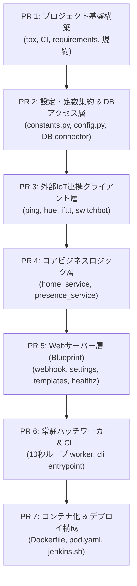

# in_out_log からの移行・再構築計画 (2026-09-20)

- **起票日**: 2026-09-20
- **対象**: `in_out_log` から `HomeIotManager` への移行
- **ステータス**: 計画確定 (Ready for Implementation)
- **システム仕様書**: [docs/architecture.md](../architecture.md)

---

## 1. 案件概要

### 1.1 背景
現行システム `in_out_log` は、在宅・外出の検知、照明・ルンバの自動操作、および入退室ログの記録を行っています。
今後、センサーの追加や制御ロジックの高度化など大規模な機能改修を予定していますが、現行コードベースは cron 実行やハードコードされた機密情報、レガシーなファイル構成を抱えています。
これらを解消し、今後の機能拡張を安全かつ迅速に行うため、現行の処理・ロジック・データベースを引き継いだ状態で `HomeIotManager` として再構築します。

### 1.2 主な要件・方針
1. **既存機能・DBの完全継承**:
   - 既存 MySQL のテーブル（`in_out`, `lasts`, `roomy_lock`）およびデータをそのまま継続利用。
   - SQL クエリはプレースホルダ（パラメータバインド）を用いた安全な実装に刷新。
2. **パブリックリポジトリとしてのセキュリティ**:
   - リポジトリは GitHub public で公開するため、機密情報（DB接続、トークン、LAN内IP）は一切リポジトリ内に保持しない。
   - MoneyBook 同様、Jenkins 側の Credentials で環境変数を保持し、デプロイ時に注入。
3. **Podman Pod マルチコンテナ構成**:
   - Web サーバー（ポート 8930）と Worker（常駐バッチループ / 10秒間隔）を 1つの Podman Pod（`hostNetwork: true`）で稼働。
4. **設定の2層分離**:
   - 機密情報は環境変数化（Jenkins 管理）。
   - 動作パラメータ（10秒インターバル、各種しきい値、時間帯など）は環境変数化せず、`homeiot/constants.py` の **1箇所に集約管理**。
5. **MoneyBook 準拠の品質・CI/CD**:
   - Python 3.12、`tox`（flake8, check_filenames.py, coverage.py）、GitHub Actions、`build/jenkins.sh`。

---

## 2. プルリクエスト (PR) 分割計画

レビュー負担を軽減し、各ステップの動作確認・CI green を担保するため、実装を以下の **7つの小さな PR** に細かく分離して段階的に進めます。

| PR 番号 | タイトル / 対象 | 主な変更内容 | テスト・検証内容 |
|---|---|---|---|
| **PR 1** | プロジェクト基盤の構築 | ・ディレクトリ構造の作成 ・`requirements/` 分割ファイル (`requirements_dev.txt`, `requirements_lint.txt`, `requirements_test.txt`) の配置（必要に応じて順次追加する方針） ・`tox.ini` (lint, unittest) の作成 ・`scripts/check_filenames.py` の作成 ・`.github/workflows/ci.yml` (GitHub Actions CI) ・`.gitignore`, `.env.example`, `README.md` | `tox -e lint` 疎通確認、GitHub Actions CI の動作確認 |
| **PR 2** | 設定管理 & DBアクセス層 | ・`homeiot/constants.py`（動作パラメータの1箇所集約） ・`homeiot/config.py`（環境変数ローダー） ・`homeiot/db/connector.py`（MySQLパラメータバインドDAO） | 設定読み込みの単体テスト、DB クエリ発行・モックテスト（`tests/test_config.py`, `tests/test_db.py`） |
| **PR 3** | 外部IoT連携クライアント層 | ・`homeiot/clients/ping.py`（スマホICMP Ping判定） ・`homeiot/clients/hue.py`（Philips Hue ローカルREST API） ・`homeiot/clients/ifttt.py`（ルンバ/照明 IFTTT Webhook） ・`homeiot/clients/switchbot.py`（SwitchBot API/Webhookパース） | 各外部通信のモック単体テスト（`tests/test_clients.py` 等） |
| **PR 4** | コアビジネスロジック層 | ・`homeiot/services/home_service.py`（在宅・外出時の家電制御判定） ・`homeiot/services/presence_service.py`（スマホ・センサー状態統合） | 現行 `test_check.py` のシナリオ（時間帯・閾値・在宅判定・ルンバロック）を網羅した単体テスト（目標カバレッジ 100%） |
| **PR 5** | Webサーバー層 (Blueprint) | ・`homeiot/app.py`（Flask アプリケーションファクトリ） ・`homeiot/web/webhook.py`（SwitchBot Webhook / ポート 8930） ・`homeiot/web/settings.py`（ルンバロック設定UI） ・`homeiot/templates/settings.html` ・`/healthz` エンドポイント | Flask テストクライアントを用いたエンドポイント検証（`tests/test_web.py`） |
| **PR 6** | 常駐バッチワーカー & CLI | ・`homeiot/services/batch_worker.py`（10秒間隔監視ループ、例外安全、シグナルハンドリング） ・`homeiot/cli.py`（`python -m homeiot.cli web` / `worker` 起動切替） | ワーカーの停止シグナル・ループ単体テスト、CLI オプションテスト |
| **PR 7** | コンテナ化 & デプロイ構成 | ・`build/Dockerfile`（Python 3.12-slim マルチステージ） ・`build/pod.yaml`（ポート 8930, `hostNetwork: true` Podman Pod） ・`build/jenkins.sh`（MoneyBook準拠のビルド・デプロイスクリプト） | ローカル Docker/Podman ビルド確認、YAML構文バリデーション |

---

## 3. 検証 & 本番切り替え手順

すべての PR がマージされた後、以下の手順で安全に本番環境の切り替えを行います：

1. **Jenkins 側の準備**:
   - HomeIotManager 用の環境変数を Jenkins Credentials / ジョブパラメータに登録。
2. **Podman Pod 起動**:
   - Jenkins からデプロイジョブを実行し、ホスト上に `homeiot-pod` を起動。
   - `podman pod ps` および `podman logs` で Web/Worker の起動とヘルスチェック（`/healthz`）の成功を確認。
3. **リバースプロキシ切り替え**:
   - ホスト側の Nginx 設定を更新し、外部からの SwitchBot Webhook 転送先ポートを 8930 に切り替え。
4. **現行 cron の停止**:
   - 現行 `in_out_log` の cron ジョブを停止。
5. **稼働監視**:
   - スマホの Wi-Fi 接続・切断、SwitchBot 人感センサーの反応によるログおよび DB（`in_out`, `lasts`）の更新をリアルタイムで監視。

---

## 4. チェックリスト

- [ ] PR 1: プロジェクト基盤の構築
- [ ] PR 2: 設定管理 & DBアクセス層
- [ ] PR 3: 外部IoT連携クライアント層
- [ ] PR 4: コアビジネスロジック層
- [ ] PR 5: Webサーバー層 (Blueprint)
- [ ] PR 6: 常駐バッチワーカー & CLI
- [ ] PR 7: コンテナ化 & デプロイ構成
- [ ] 本番デプロイ & 切り替え完了
