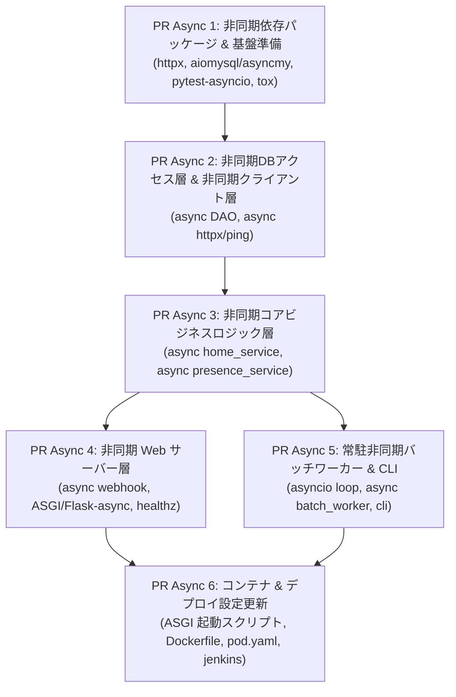

# 非同期処理化 (asyncio対応) 実行計画 (2026-09-21)

- **起票日**: 2026-09-21
- **対象**: `HomeIotManager` の Web サーバーおよびバッチワーカーの `asyncio` 非同期化
- **ステータス**: 計画確定 (Ready for Implementation)
- **関連計画書**: [docs/plans/2026-09-20-migration-from-in-out-log.md](2026-09-20-migration-from-in-out-log.md)
- **システム仕様書**: [docs/architecture.md](../architecture.md)

---

## 1. 案件概要

### 1.1 背景
`HomeIotManager` は PR 5 までマージが完了し、設定層・DBアクセス層・外部クライアント層・ビジネスロジック層・Webサーバー層（Flask Blueprint）が構築されました。
しかし、外部IoTサービス（Hue, IFTTT, SwitchBot API）のHTTPリクエスト、Ping判定、およびDBクエリ処理が同期（I/Oブロッキング）処理となっており、Web サーバーのレスポンス遅延やバッチワーカー（10秒ループ）での処理タイムアウト・並行処理性の制約が懸念されます。

これらを解決し、リアルタイム性とノンブロッキング性を高めるため、Web サーバーおよび常駐バッチワーカーの全コンポーネントを Python の `asyncio` を基盤とした非同期処理構成へ移行します。

### 1.2 主な要件・方針
1. **`asyncio` による一貫した非同期化**:
   - HTTP クライアント: `requests.Session` から `httpx.AsyncClient` へ移行。
   - ICMP Ping: `asyncio.create_subprocess_exec` による非同期プロセス実行化。
   - DB アクセス: `aiomysql` または `asyncmy`（あるいは `asyncio.to_thread` / 非同期スレッドプール）による非同期クエリ実行。
2. **Web サーバーの非同期化**:
   - ASGI 対応フレームワーク（`Quart` / `FastAPI` / Flask async 対応）または ASGI サーバー (`uvicorn` / `hypercorn`) による非同期 Web API / Webhook エンドポイント化。
   - SwitchBot Webhook 受信時に非同期バックグラウンドタスク（`asyncio.create_task`）でロジックを実行し、即座に 200 OK を返却可能とする。
3. **バッチワーカーの非同期化**:
   - `asyncio.sleep` を利用した非同期イベントループ常駐ワーカーの実装。
   - 複数スマホに対する Ping チェック等の並列化（`asyncio.gather`）。
   - 優雅なシャットダウン（`SIGINT`/`SIGTERM` ハンドリングとキャンセレーション処理）。
4. **テスト・品質の維持**:
   - `pytest-asyncio` 等を活用し、既存の単体テスト・モックテストを async 対応にアップグレード。
   - カバレッジ低下・リバースイシューのない状態をテストで担保。

---

## 2. プルリクエスト (PR) 分割計画

変更の影響範囲を制御し、段階的に動作確認・CI をパスさせるため、以下の 6 つの PR に分割して進めます。

| PR 番号 | タイトル / 対象 | 主な変更内容 | テスト・検証内容 |
|---|---|---|---|
| **PR Async 1** | 非同期依存パッケージ & テスト基盤準備 | ・`requirements/` への `httpx`, `aiomysql`/`asyncmy`, `pytest-asyncio` 等の追加 ・`tox.ini` のテスト設定更新 | `tox` による依存関係インストールおよび lint 疎通確認 |
| **PR Async 2** | 非同期DBアクセス層 & クライアント層 | ・`homeiot/db/connector.py` の async 対応（コネクションプール/クエリ非同期化） ・`homeiot/clients/` (ping, hue, ifttt, switchbot) の `async` 化 (`httpx.AsyncClient`, `asyncio.create_subprocess_exec`) | 非同期モックを用いたクライアント・DB関数の単体テスト (`tests/test_clients.py`, `tests/test_db.py`) |
| **PR Async 3** | 非同期コアビジネスロジック層 | ・`homeiot/services/home_service.py` & `presence_service.py` の `async/await` 化 ・Ping判定の並列実行 (`asyncio.gather`) 対応 | ビジネスロジックの非同期単体テストの全ケース成功 (`tests/test_services.py`) |
| **PR Async 4** | 非同期 Web サーバー層 | ・Webhook エンドポイントの非同期化（`async` ルート化または ASGI 対応） ・Webhook 受信時の非同期タスクキック (`asyncio.create_task`) | 非同期テストクライアントを用いた Webhook / `/healthz` の単体テスト |
| **PR Async 5** | 常駐非同期バッチワーカー & CLI | ・`homeiot/services/batch_worker.py` の `asyncio` メインループ化 (`asyncio.sleep`) ・シグナルハンドリング（`SIGTERM` / `SIGINT`）による安全な終了処理 ・`homeiot/cli.py` で `asyncio.run()` によるワーカー起動サポート | ワーカーの非同期ループ起動・停止テスト (`tests/test_batch_worker.py`) |
| **PR Async 6** | コンテナ & デプロイ構成更新 | ・`build/Dockerfile` / `build/pod.yaml` の Uvicorn/Hypercorn/ASGI 起動コマンドへの対応 ・`build/jenkins.sh` の検証 | ローカル Docker/Podman ビルド、コンテナ内での Web/Worker 非同期起動確認 |

---

## 3. 検証 & 移行チェックリスト

- [ ] PR Async 1: 非同期依存パッケージ & テスト基盤準備
- [ ] PR Async 2: 非同期DBアクセス層 & クライアント層
- [ ] PR Async 3: 非同期コアビジネスロジック層
- [ ] PR Async 4: 非同期 Web サーバー層
- [ ] PR Async 5: 常駐非同期バッチワーカー & CLI
- [ ] PR Async 6: コンテナ & デプロイ構成更新
- [ ] 全ユニットテスト pass & カバレッジ確認
- [ ] 本番デプロイ準備完了
